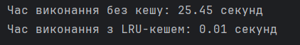
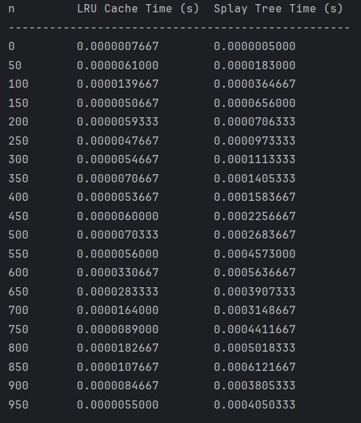
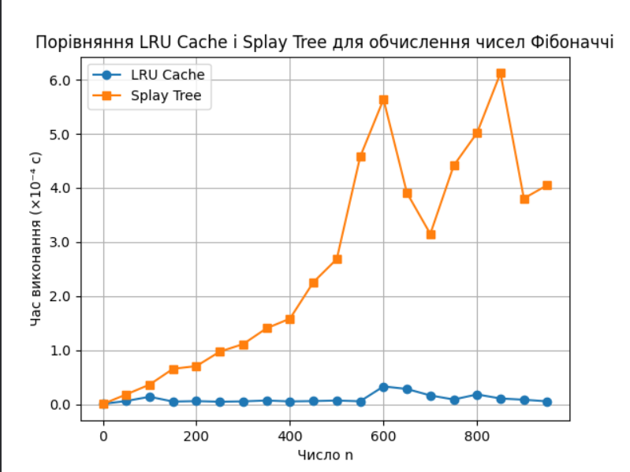

## Table of Contents

- [Task1](#task1)
- [Task2](#task2)

## Task1
Results

*Результат порівняння обчислення суми діапазону за допомогою LRU-кешу і без нього*

Використання **LRU-кешу** значно **прискорює обчислення запитів на суму діапазону**:

  Виходячи з цього можна сказати, що:
- Кешування зменшує кількість повторних обчислень, **прискорюючи виконання в тисячі разів**.
- Найбільший бенефіт при кешуванні у швидкості відчутний при повторюваних запитах на однакові діапазони.
- LRU-кеш ефективний для задач, де **велика кількість запитів, а діапазони часто повторюються**.

  Тому використання LRU-кешу **суттєво покращує продуктивність** у задачах з повторюваними запитами.

## Task2

Результат порівняння LRU Cache і Splay Tree для обчислення чисел Фібоначчі:

*Таблиця - Результат порівняння обчислення чисел Фібоначчі за допомогою LRU-кешу і Splay Tree*

*Графічна залежність часу виконання обчислення чисел Фібоначчі за допомогою LRU-кешу і Splay Tree*

*Висновок*

| **Метод**       | **Переваги**                                      | **Недоліки**                                    | **Загальний висновок** |
|-----------------|-------------------------------------------------|-----------------------------------------------|------------------------|
| **LRU Cache**   | Найшвидший, стабільний час виконання Простота реалізації (@lru_cache) | Залежить від розміру кешу | **Найкращий для Фібоначчі** |
| **Splay Tree**  | Динамічне балансування дерева Підходить для часто повторюваних запитів | Значно повільніший для великих `n` Додаткові витрати на ротації | **Неоптимальний для Фібоначчі** |

LRU Cache**ефективніший** для обчислення чисел Фібоначчі, оскільки уникає зайвих обчислень та має стабільний час виконання.  
Splay Tree корисний для інших сценаріїв (часті пошуки), але **не підходить** для цієї задачі.
